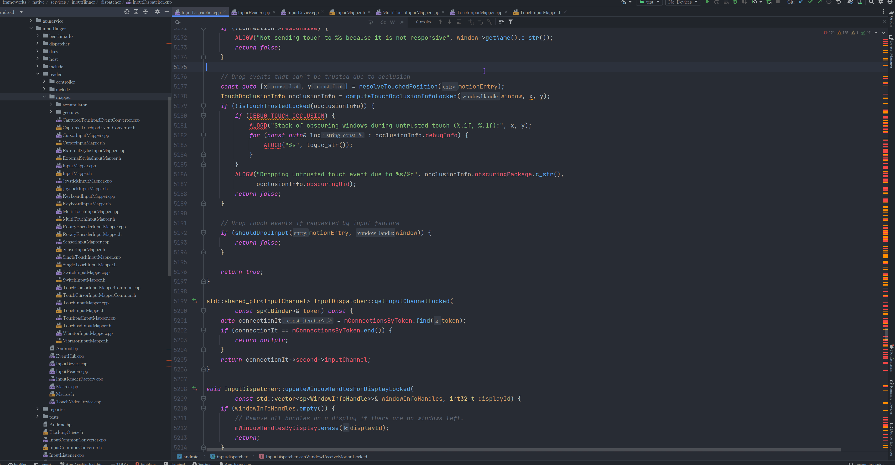
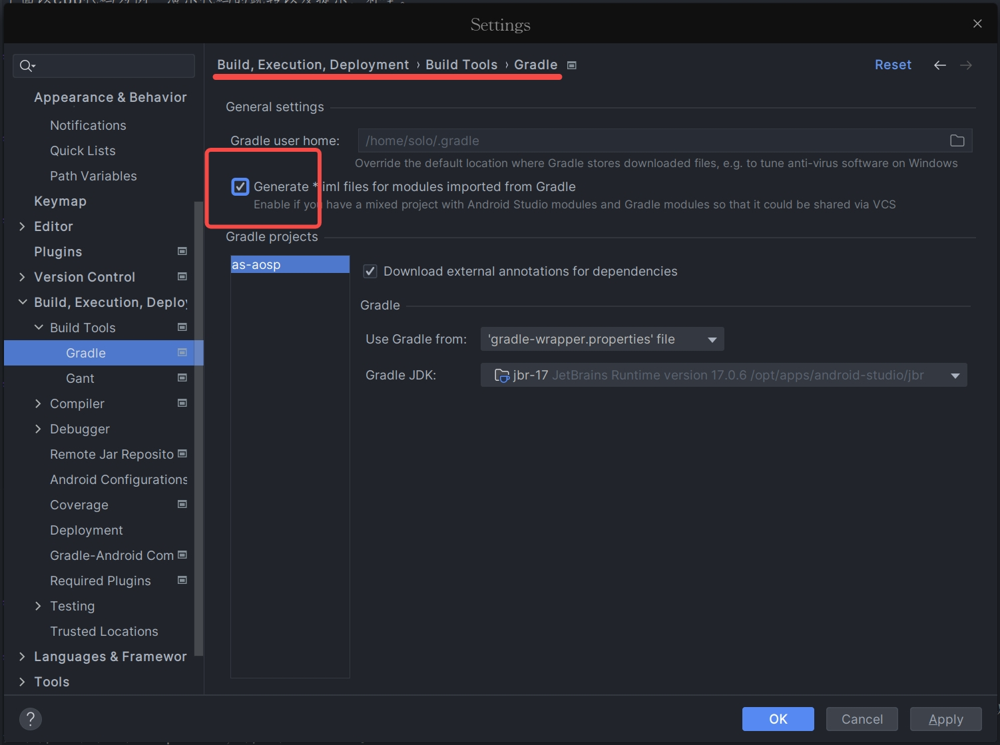
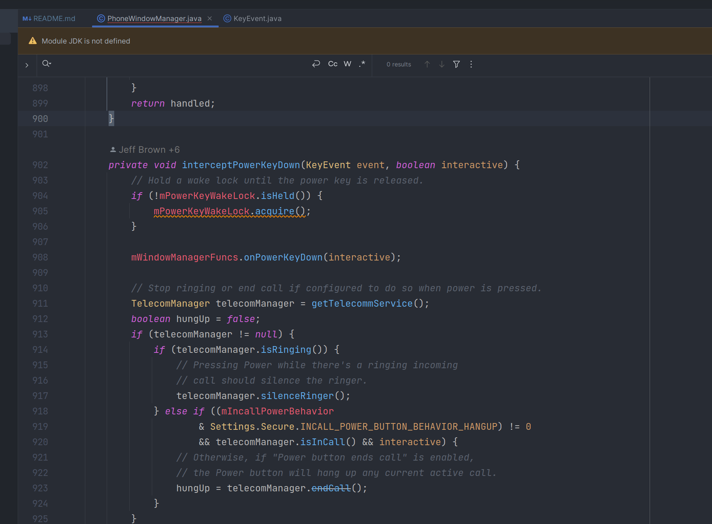

<!-- TOC -->
* [简介](#简介)
  * [支持IDE](#支持ide)
  * [对比 asfp 优缺点](#对比-asfp-优缺点)
  * [跳转](#跳转)
  * [提示、补全](#提示补全)
  * [约定](#约定)
* [配置介绍](#配置介绍)
  * [settings.gradle](#settingsgradle)
  * [根目录build.gradle](#根目录buildgradle)
  * [config.gradle](#configgradle)
  * [aosp.gradle](#aospgradle)
  * [cts.gradle](#ctsgradle)
  * [lineage.gradle](#lineagegradle)
  * [native](#native)
  * [删除android.jar](#删除androidjar)
  * [支持AIDL](#支持aidl)
* [编译](#编译)
* [版本](#版本)
  * [5.x.x](#5xx)
  * [4.0.0](#400)
  * [3.2.1](#321)
  * [2.1.0](#210)
  * [1.x.x](#1xx)
* [后话](#后话)
* [即时讨论](#即时讨论)
<!-- TOC -->

# 简介

此as工程可以快速的导入aosp framework(包含java/native)、 aosp 系统app、 国内某些厂商扩展的fwk代码；

比 idegen(android.ipr和android.iml) 方案还快，并且“联想”也很方便。


## 支持IDE
- Android Studio
- IntelliJ IDEA
- CLion

> IDEA 只支持 java 模块，并且不需要执行 task deleteAndroidSdk。比使用 Android Studio 方便。
>
> CLion 只支持 native 模块，直接打开 aosp-native 后，需要改 aosp-native/CMakeLists.txt 里 set(ANDROID_ROOT ${BUILD_NATIVE_ROOT})


## 对比 asfp 优缺点

<table>

<thead>
<tr>
<th align="center"></th>
<th align="center">as-asop</th>
<th align="center">asfp</th>
</tr>
</thead>

<tbody><tr>

<td align="center">Author</td>
<td align="center">Solo</td>
<td align="center">Google</td>
</tr>

<tr>
<td align="center">发布时间</td>
<td align="center">2022下半年</td>
<td align="center">2023下半年</td>
</tr>

<tr>
<td align="center">支持平台</td>
<td align="center">linux、macos、win</td>
<td align="center">linux</td>
</tr>

<tr>
<td align="center">Android Studio 版本</td>
<td align="center">任意版本</td>
<td align="center">特殊版本，即asfp版本</td>
</tr>

<tr>
<td align="center">IDEA 版本</td>
<td align="center">任意版本（仅Java模块）</td>
<td align="center">不支持IDEA</td>
</tr>

<tr>
<td align="center">CLion 版本</td>
<td align="center">任意版本（仅native模块）</td>
<td align="center">不支持CLion</td>
</tr>

<tr>
<td align="center">以下代码支持跳转、提示</td>
<td align="center">java、kotlin、c、c++</td>
<td align="center">java、kotlin、c、c++</td>
</tr>

<tr>
<td align="center">需要编译</td>
<td align="center">否</td>
<td align="center">是</td>
</tr>

<tr>
<td align="center">需要完整代码</td>
<td align="center">否</td>
<td align="center">是</td>
</tr>

<tr>
<td align="center">首次加载耗时</td>
<td align="center">根目录只有部分模块代码，加载几分钟；<br>根目录包含所有aosp代码，加载1.5h左右</td>
<td align="center">代码已全编译，加载1h左右；<br>代码未全编译，编译时间+加载1h左右</td>
</tr>

<tr>
<td align="center">UI</td>
<td align="center">无UI，通过改脚本来实现功能，自定义度高</td>
<td align="center">有UI，可通过界面添加模块（依赖每个模块的android.bp，无法自定义）</td>
</tr>

</tbody>

</table>


> 关于 “首次加载耗时” 提到 “根目录只有部分模块代码” ，我试过两种方案：
> 1. 软链接：比如完整的aosp代码是在/home/solo/workspace/code/aosp，我把需要加载的模块通过软链接的方式 ln 到 /home/solo/code/aosp。
>    可以参考工程里的 scripts/ln.sh 脚本文件，SOURCE、DEST改成自己的源目录，目标目录即可；也可以在数组projects中添加自己需要的模块目录。
>    ln.sh 脚本文件里只软链接了常用的一些模块，每个人可以根据自己的需求删改。
> 2. 只下载需要模块。
>
> “支持平台” 提到as-asop支持win，经过朋友的测试，是没任何问题的，但有一点需要注意：
> 如果你的代码目录是 D:\code\aosp\
> 请不要写成 D:\\code\\aosp\\
> 正确的写法 D:/code/aosp/
>
> 总结：遥遥领先[狗头]


下面以cpp代码为例，演示代码的跳转以及提示、补全。

## 跳转


## 提示、补全



## 约定

- aosp模块：大驼峰命名
- aosp模块变种或厂商模块：小写命名（包含字符-）


# 配置介绍

## settings.gradle

settings.gradle 位于根目录下，用于项目的配置，常见的是配置子工程。一个子工程只有在 setting.gradle 中配置了，才能够被识别，构建的时候才会被包含进去。

如果需要新增一个 aosp 的模块，需要在这里配置。

使用者可以根据自己的需求修改 settings.gradle 的子模块，比如 Settings 开发不需要 native 部分、SystemUI 部分等，可以注释使其不被识别，加快加载 as 速度，降低内存。


## 根目录build.gradle

根目录 build.gradle 文件配置了很多扩展的 gradle 脚本，可根据实际情况自行添加到对应的脚本或者新增脚本。
```bash
apply from: 'scripts/config.gradle'
apply from: 'scripts/aosp.gradle'
apply from: 'scripts/car.gradle'
apply from: 'scripts/lineage.gradle'
```


## config.gradle

config.gradle最重要的功能就是通过aospRoot配置Android源码的根目录。

> aosp.gradle
> 
> car.gradle
>
> cts.gradle
>
> 其他gradle脚本
> 
> 都是通过 config.gradle 的 aospRoot 获取到 Android 源码的根目录。

config.gradle 脚本除了配置基本的 android sdk；还有一个很重要的功能，就是获取所有的模块名称（也就是 settings.gradle 配置的子模块）。

也就是说 allModules 不需要手动维护，在 settings.gradle 里新增一个 module，脚本会自动识别到 project name 并添加到 allModules 数组。
这个allModules数组的作用是方便每个 module 快速的互相依赖，如：

```bash
rootProject.ext.allModules.each { dependence -> compileOnly project(dependence.value) }
```

以上写法会循环依赖，真正的 app gradle 工程不能这样做的。这里这样子做是因为我们只是为了方便as阅读代码或者改代码，真正编译的时候还是用 ninja、make。

## aosp.gradle

- aospDir: 通过 config.gradle 的 aospRoot 获取到 Android 源码的根目录。也可以自己配置源码所在的目录，如: aospDir = "/home/solo/code/aosp"。
- aosp: 一个大数组，维护很多模块需要的路径。
  - root: 等同于aospDir所设置的android源码根目录。
  - Framework: 配置framework.jar的源码路径
  - Services: 配置services.jar的源码路径
  - FrameworkRes: 配置frameworkRes.apk的源码路径
  - SystemUI: 配置SystemUI.apk的源码路径
  - SystemUIPluginLib: 配置SystemUIPluginLib.jar的源码路径
  - Settings: 配置Settings.apk的源码路径
  - SettingsLib: 配置SettingsLib.aar的源码路径
  - SettingsProvider: 配置SettingsProvider.apk的源码路径
  - CarFramework: 配置CarFramework的源码路径
  - CarServices: 配置CarServices.apk的源码路径
  - Connectivity: 连接相关，包括Tethering、nearby、netd等等的源码路径
  - ExtServices: ExtServices.apk的源码路径


> 每个模块都是通过配置的 manifest、res、assets、jni、src、aidl 来分别配置 AndroidManifest.xml、资源文件目录、assets目录、jni代码目录、java\kt源码目录、aidl目录 等。
>
> 不需要的可以写空。

> 温馨提示
>
> 在这个文件中只需要把 aospDir 设置成自己android源码的根目录就可以。
>
> 里面具体模块的源码路径基本上都添加了（但确实不是100%添加），如果因为使用aosp版本不一致或者别的原因可以根据自己需要再添加。


## cts.gradle

主要是配置了一些CTS模块，目前只配置了 CtsWindowManagerDeviceTestCases 、CtsInputTestCases 。


## lineage.gradle

lineage代码所在的路径，主要是配置了 lineage-framework、lineage-services、lineage-framework-res、lineage-preference-lib、lineage-settings-provider。

可以根据自己的需要修改lineageDir对应的目录即可。


## native

通过根目录下的 settings.gradle 可以看到有如下的配置：

```bash
/*************** aosp native ***************/
//include ':aosp-cmake'
/*************** aosp native ***************/
```
**默认关闭native模块**

在 aosp-cmake 目录下包含了所有的native模块，下面对 aosp-cmake 根目录下的两个文件稍作解释：

- projects.json
  所有的模块名字，以及此模块对应的 CMakeLists.txt 目录。

- CMakeLists.txt
  主 cmake 文件，可以配置打开或者关闭不需要的模块。
  - BUILD_NATIVE_ROOT
    BUILD_NATIVE_ROOT 是 build.gralde 配置的源码目录，cmake 会判断 BUILD_NATIVE_ROOT 的路径是否存来而设置 ANDROID_ROOT 
    否则 ANDROID_ROOT=~/code/aosp  
  - ANDROID_TARGET_ARCH
    也就是 TARGET_ARCH
  - ANDROID_ARCH_VARIANT
    也就是 TARGET_ARCH_VARIANT
  - ANDROID_CPU_VARIANT
    也就是 ArchType
  - OUT_ARCH_CPU
    也就是 {TARGET_ARCH}_{TARGET_ARCH_VARIANT}_{ANDROID_CPU_VARIANT}
    设置这几个配置是为了 CMakeLists.txt 里有一些源码是从 out 里获取，如：
    ${OUT_INTERMEDIATES_ROOT}/frameworks/native/services/surfaceflinger/sysprop/libSurfaceFlingerProperties/android_${OUT_ARCH_CPU}_static/gen/sysprop/SurfaceFlingerProperties.sysprop.cpp
  - add_subdirectory
    可根据自己下需求打开或者关闭相应的模块


## 删除android.jar

根据以上步骤配置好后看，c/cpp 代码可以正确跳转了；但 java 有的代码还是跳转到 Android SDK 的 android.jar 里。所以还需要多做一步额外的配置，如下图：


如果在 .idea/modules 文件夹下没看到“以模块为名词”文件夹，那需要如上图勾选"generate *.impl files for modules import from gradle"。

看到 .idea/modules 文件夹下生成“以模块为名词”文件夹，接着 sync，sync 过程中 gralde 会执行 deleteAndroidSdk 任务。这个 task 主要的作用就是去删除iml文件中的：

```bash
<arg>$USER_HOME$/Android/Sdk/platforms/android-34/android.jar</arg>
<arg>$USER_HOME$/Android/Sdk/build-tools/34.0.0/core-lambda-stubs.jar</arg>
```

并把下面这行配置放在最后面。

```bash
<orderEntry type="jdk" jdkName="Android API 34, extension level 7 Platform" jdkType="Android SDK" />
```

sync 后确认 iml 文件中以上提的都已经执行好了，就可以重启AS；重启之后打开一个任意一个 java 代码都会看到：



点 KeyEvent 已经能正确跳转到源码了，而不是跳转到 Android SDK 的 android.jar 里。

> 关于勾选"generate *.impl files for modules import from gradle"后，要不要去掉勾选的问题，可以视情况而定。
>
> 其目的只是为了 .idea/modules 文件夹下每个模块都有自己的iml配置。并确保iml中没有android.jar的配置和jdk的排序在最后面即可。
>
> 如果配置目录新增了src或者配置了新的路径对的，建议更新iml并重新sync(确保删除Android SDK的配置)。


## 支持AIDL

在 scripts/config.gradle 里配置 build_aidl = true ，并 "Rebuild Project" 就可以生成java文件。

生成 java 文件后改成 false ，确保模块直接能正常跳转。

因为前面提到过模块互相循环依赖，无法无法编译； 所以在 scripts/android-build.gradle 里配置了如下：

```
if (rootProject.ext.build_aidl.toBoolean()) {
    println("don't compileOnly forEach when build aidl")
} else {
    compileOnly project(dependence.value)
}
```

> "Rebuild Project" 时编译 aidl 会有遇到报错的情况，所以这里支持 AIDL 只能看运气；如果你的 AIDL 能编译出来，那恭喜你，运气真好！


# 编译

此工程无法编译framework.jar或者services.jar，请使用aosp推荐的编译方式。

[global_scripts](https://github.com/i-rtfsc/global_scripts) 工程里的 [gs_android_build.sh](https://github.com/i-rtfsc/global_scripts/blob/main/plugins/android/build/gs_android_build.sh) 脚本实现了很多模块编译的快捷键。
可以单独下载这个脚本并放到环境变量里，或者是用整个 [global_scripts](https://github.com/i-rtfsc/global_scripts) 实现插件化的方案【详情可以参考该工程的README】。

# 版本
as-aosp经历了两年多的更新，每次更新都是根据自己的需求。
5.x.x 打算再次对 c/c++ 模块进行大改，自己本地验证大改后 vs 也能丝滑使用。

## 5.x.x
- car
- [x] car 相关模块都放到 car 文件夹下

- aosp-cmake
- [x] 根据 Android.bp/Android.mk 生成 CMakeLists.txt


## 4.0.0
- [x] 新增 CarSystemUI
- [x] 新增 CarSettings
- [x] 移除 Java 模块下的 JNI 脚本
- [x] 移除 Wifi
- [x] framework 、services 包含 Wifi 相关（保持跟原生一致）

- CTS
- [x] CtsWindowManagerDeviceTestCases
- [x] CtsInputTestCases
> CTS 相关的模块都放到 cts 文件夹下

> 4开头版本主要是提供车机的两个模块，供其他车机模块参考。
>
> 3.x 版本想要解决 【解决 Java 模块 包含 JNI 时，JNI代码无法跳转问题】，经过一段时间研究后，无法解决。
> 后续打算大改版 native 模块，所以暂时不在 Java 模块下提供 JNI，而是打算刚才使用 native 都单独一个模块。
> 基于这点，也没必要提供老版本的 【生成 cmakelist 脚本】


## 3.2.1

- [x] 移除 BUILD_APPLICATION
- [x] 移除根目录下的 native 模块
- [x] 把所有 native 模块都放在 aosp-native ，并通过 add_subdirectory() 方式添加子模块
- [ ] 解决 Java 模块 包含 JNI 时，JNI代码无法跳转问题
- [ ] 提供 生成 cmakelist 脚本

> 最初的 BUILD_APPLICATION 确实是用了编译 test app，但目前功能已经改版；不需要编译 test app 了，并且这个工程无法编译 aosp 模块，为了不引起歧义，故删除。


## 2.1.0

- java模块

- [x] Framework: framework.jar
- [x] Services: services.jar
- [x] FrameworkRes: framework-res.apk
- [x] SystemUI: SystemUI.apk
- [x] SystemUIPluginLib: SystemUIPluginLib.jar
- [x] Settings: Settings.apk
- [x] SettingsLib: SettingsLib.aar
- [x] SettingsProvider: SettingsProvider.apk
- [x] CarFramework: CarFramework
- [x] CarServices: CarServices.apk
- [x] Connectivity: 包括Tethering、nearby、netd相关的源码
- [x] Wifi: wifi相关的源码
- [x] ExtServices: ExtServices.apk

> 在 1.x.x 的基础上完善更多功能。

- native模块

- [x] AndroidRuntime: libandroid_runtime.so
- [x] AndroidServices: libandroid_servers.so
- [x] InputFlinger: inputflinger模块
- [x] SurfaceFlinger: surfaceflinger模块
- [x] NeuralNetworks: 封装tensorflow源码
- [x] TensorFlow: google的tensorflow源码

- aidl
- [x] 支持 aidl 编译成 java

## 1.x.x

- [x] Framework: framework.jar
- [x] Services: services.jar
- [x] FrameworkRes: framework-res.apk
- [x] SystemUI: SystemUI.apk
- [x] SystemUIPluginLib: SystemUIPluginLib.jar
- [x] Settings: Settings.apk
- [x] SettingsLib: SettingsLib.aar
- [x] SettingsProvider: SettingsProvider.apk
- [x] CarFramework: CarFramework
- [x] CarServices: CarServices.apk
- [x] Connectivity: 包括Tethering、nearby、netd相关的源码
- [x] Wifi: wifi相关的源码
- [x] ExtServices: ExtServices.apk
- [x] 多个手机厂商的 Framework 、Services、Ext-Framework 、Ext-Services 等

# 后话

此工程包含的 miui、flyme、oppo、vivo 等配置 不涉及任何这几家公司的代码，所以并没有泄露任何公司的代码！

分享此工程的目的是为了android系统工程师能提高工作效率！请勿小事化大！

此工程拆封成很多分支，默认是 aosp 分支。切分支有惊喜[狗头]。

# 即时讨论


可以通过 [issues](https://github.com/i-rtfsc/as-aosp/issues) 反馈问题，或者通过微信联系。
