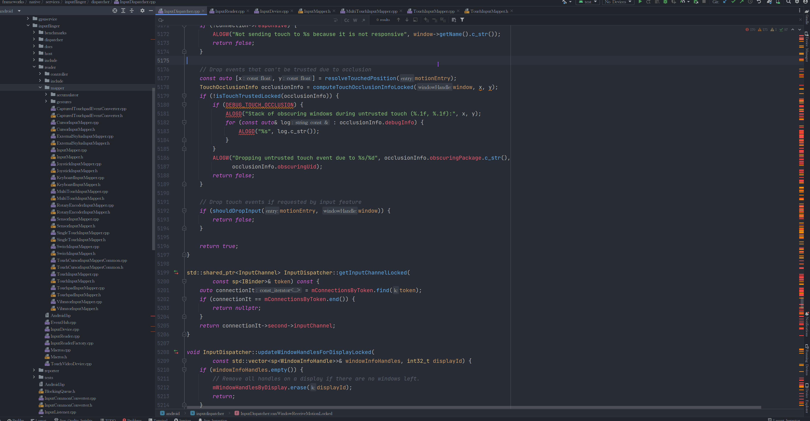

<!-- TOC -->
* [as-aosp 工程简介](#as-aosp-工程简介)
  * [支持IDE](#支持ide)
    * [对比 asfp 优缺点](#对比-asfp-优缺点)
  * [跳转](#跳转)
  * [提示、补全](#提示补全)
  * [使用教程](#使用教程)
  * [编译](#编译)
  * [版本](#版本)
    * [5.x.x](#5xx)
      * [scrjars](#scrjars)
      * [android sdk](#android-sdk)
      * [art](#art)
      * [car](#car)
      * [aosp-cmake](#aosp-cmake)
      * [ext](#ext)
      * [文件夹结构调整](#文件夹结构调整)
    * [4.0.0](#400)
      * [Car](#car-1)
      * [移除/调整](#移除调整)
      * [CTS](#cts)
    * [3.2.1](#321)
      * [移除/调整](#移除调整-1)
    * [2.1.0](#210)
      * [java模块](#java模块)
      * [native模块](#native模块)
      * [aidl](#aidl)
    * [1.x.x](#1xx)
  * [后话](#后话)
  * [即时讨论](#即时讨论)
<!-- TOC -->

# as-aosp 工程简介

工程地址：[as-aosp](https://github.com/i-rtfsc/as-aosp)

此as工程可以快速的导入aosp framework(包含java/native)、 aosp 系统app、 国内某些厂商扩展的fwk代码；

比 idegen(android.ipr和android.iml) 方案还快，并且“联想”也很方便。

## 支持IDE

- Android Studio
- IntelliJ IDEA
- CLion

> IDEA 只支持 java 模块。
>
> CLion 只支持 native 模块，直接打开 aosp-native 后，需要改 aosp-native/CMakeLists.txt 里 set(ANDROID_ROOT ${BUILD_NATIVE_ROOT})

## 对比 asfp 优缺点

<table>

<thead>
<tr>
<th align="center"></th>
<th align="center">as-asop</th>
<th align="center">asfp</th>
</tr>
</thead>

<tbody><tr>

<td align="center">Author</td>
<td align="center">Solo</td>
<td align="center">Google</td>
</tr>

<tr>
<td align="center">发布时间</td>
<td align="center">2022下半年</td>
<td align="center">2023下半年</td>
</tr>

<tr>
<td align="center">支持平台</td>
<td align="center">linux、macos、win</td>
<td align="center">linux</td>
</tr>

<tr>
<td align="center">Android Studio 版本</td>
<td align="center">任意版本</td>
<td align="center">特殊版本，即asfp版本</td>
</tr>

<tr>
<td align="center">IDEA 版本</td>
<td align="center">任意版本（仅Java模块）</td>
<td align="center">不支持IDEA</td>
</tr>

<tr>
<td align="center">CLion 版本</td>
<td align="center">任意版本（仅native模块）</td>
<td align="center">不支持CLion</td>
</tr>

<tr>
<td align="center">以下代码支持跳转、提示</td>
<td align="center">java、kotlin、c、c++</td>
<td align="center">java、kotlin、c、c++</td>
</tr>

<tr>
<td align="center">需要编译</td>
<td align="center">否</td>
<td align="center">是</td>
</tr>

<tr>
<td align="center">需要完整代码</td>
<td align="center">否</td>
<td align="center">是</td>
</tr>

<tr>
<td align="center">首次加载耗时</td>
<td align="center">根目录只有部分模块代码，加载几分钟； 根目录包含所有aosp代码，加载1.5h左右</td>
<td align="center">代码已全编译，加载1h左右； 代码未全编译，编译时间+加载1h左右</td>
</tr>

<tr>
<td align="center">UI</td>
<td align="center">无UI，通过改脚本来实现功能，自定义度高</td>
<td align="center">有UI，可通过界面添加模块（依赖每个模块的android.bp，无法自定义）</td>
</tr>

</tbody>

</table>

下面以cpp代码为例，演示代码的跳转以及提示、补全。

## 跳转

## 提示、补全

## 使用教程

[教程001-首次配置](https://i-rtfsc.github.io/%E6%BA%90%E7%A0%81%E5%B7%A5%E7%A8%8B/as-aosp/%E6%95%99%E7%A8%8B001-%E9%A6%96%E6%AC%A1%E9%85%8D%E7%BD%AE/)

[教程002-设计思路](https://i-rtfsc.github.io/%E6%BA%90%E7%A0%81%E5%B7%A5%E7%A8%8B/as-aosp/%E6%95%99%E7%A8%8B002-%E8%AE%BE%E8%AE%A1%E6%80%9D%E8%B7%AF/)

[教程003-简单扩展](https://i-rtfsc.github.io/%E6%BA%90%E7%A0%81%E5%B7%A5%E7%A8%8B/as-aosp/%E6%95%99%E7%A8%8B003-%E7%AE%80%E5%8D%95%E6%89%A9%E5%B1%95/)

[教程004-插件扩展](https://i-rtfsc.github.io/%E6%BA%90%E7%A0%81%E5%B7%A5%E7%A8%8B/as-aosp/%E6%95%99%E7%A8%8B004-%E6%8F%92%E4%BB%B6%E6%89%A9%E5%B1%95/)

[教程005-跳转系统源码](https://i-rtfsc.github.io/%E6%BA%90%E7%A0%81%E5%B7%A5%E7%A8%8B/as-aosp/%E6%95%99%E7%A8%8B005-%E8%B7%B3%E8%BD%AC%E7%B3%BB%E7%BB%9F%E6%BA%90%E7%A0%81/)

[教程006-aidl跳转](https://i-rtfsc.github.io/%E6%BA%90%E7%A0%81%E5%B7%A5%E7%A8%8B/as-aosp/%E6%95%99%E7%A8%8B006-aidl%E8%B7%B3%E8%BD%AC/)

## 编译

此工程无法编译framework.jar或者services.jar，请使用aosp推荐的编译方式。

[global_scripts](https://github.com/i-rtfsc/global_scripts) 工程里的 [gs_android_build.sh](https://github.com/i-rtfsc/global_scripts/blob/main/plugins/android/build/gs_android_build.sh) 脚本实现了很多模块编译的快捷键。
可以单独下载这个脚本并放到环境变量里，或者是用整个 [global_scripts](https://github.com/i-rtfsc/global_scripts) 实现插件化的方案【详情可以参考该工程的README】。

## 版本
as-aosp经历了两年多的更新，每次更新都是根据自己的需求。
5.x.x 打算再次对 c/c++ 模块进行大改，自己本地验证大改后 vs 也能丝滑使用。

### 5.x.x

#### scrjars

- [x] aidl
  支持 aidl 跳转

- [ ] R.java
  支持 R 跳转

#### android sdk

适配新版 android studio，实现自动删除恢复 android.jar ，丝滑调整源码。

#### PlatformBase

不特指aosp中的哪个模块，而是android 平台一些基础的代码都放在这个模块里。

####  car

- [x] car
  相关模块都放到 car 文件夹下

####  aosp-cmake

- [x] CMakeLists.txt
  根据 Android.bp/Android.mk 生成 CMakeLists.txt

####  ext

git 忽略 ext ，方便同步代码的同时也方便个人定制化

####  文件夹结构调整

- [x]  aosp-modules
  system server、framework-res、aosp 其他模块

- [x]  aosp-car
  aosp car 模块

- [x] aosp-cts
  aosp cts 模块

### 4.0.0

####  Car

- [x] 新增 CarSystemUI

- [x] 新增 CarSettings

####  移除/调整

- [x] 移除 Java 模块下的 JNI 脚本

- [x] 移除 Wifi

- [x] framework 、services 包含 Wifi 相关（保持跟原生一致）

####  CTS

- [x] CtsWindowManagerDeviceTestCases
- [x] CtsInputTestCases

> CTS 相关的模块都放到 cts 文件夹下

> 4开头版本主要是提供车机的两个模块，供其他车机模块参考。
>
> 3.x 版本想要解决 【解决 Java 模块 包含 JNI 时，JNI代码无法跳转问题】，经过一段时间研究后，无法解决。
> 后续打算大改版 native 模块，所以暂时不在 Java 模块下提供 JNI，而是打算刚才使用 native 都单独一个模块。
> 基于这点，也没必要提供老版本的 【生成 cmakelist 脚本】

### 3.2.1

####  移除/调整

- [x] 移除 BUILD_APPLICATION

- [x] 移除根目录下的 native 模块

- [x] 把所有 native 模块都放在 aosp-native ，并通过 add_subdirectory() 方式添加子模块

- [ ] 解决 Java 模块 包含 JNI 时，JNI代码无法跳转问题

- [ ] 提供 生成 cmakelist 脚本

> 最初的 BUILD_APPLICATION 确实是用了编译 test app，但目前功能已经改版；不需要编译 test app 了，并且这个工程无法编译 aosp 模块，为了不引起歧义，故删除。

### 2.1.0

####  java模块

- [x] Framework: framework.jar

- [x] Services: services.jar

- [x] FrameworkRes: framework-res.apk

- [x] SystemUI: SystemUI.apk

- [x] SystemUIPluginLib: SystemUIPluginLib.jar

- [x] Settings: Settings.apk

- [x] SettingsLib: SettingsLib.aar

- [x] SettingsProvider: SettingsProvider.apk

- [x] CarFramework: CarFramework

- [x] CarServices: CarServices.apk

- [x] Connectivity: 包括Tethering、nearby、netd相关的源码

- [x] Wifi: wifi相关的源码

- [x] ExtServices: ExtServices.apk

> 在 1.x.x 的基础上完善更多功能。

####  native模块

- [x] AndroidRuntime: libandroid_runtime.so

- [x] AndroidServices: libandroid_servers.so

- [x] InputFlinger: inputflinger模块

- [x] SurfaceFlinger: surfaceflinger模块

- [x] NeuralNetworks: 封装tensorflow源码

- [x] TensorFlow: google的tensorflow源码

#### aidl

- [x] 支持 aidl 编译成 java

### 1.x.x

- [x] Framework: framework.jar

- [x] Services: services.jar

- [x] FrameworkRes: framework-res.apk

- [x] SystemUI: SystemUI.apk

- [x] SystemUIPluginLib: SystemUIPluginLib.jar

- [x] Settings: Settings.apk

- [x] SettingsLib: SettingsLib.aar

- [x] SettingsProvider: SettingsProvider.apk

- [x] CarFramework: CarFramework

- [x] CarServices: CarServices.apk

- [x] Connectivity: 包括Tethering、nearby、netd相关的源码

- [x] Wifi: wifi相关的源码

- [x] ExtServices: ExtServices.apk

- [x] 多个手机厂商的 Framework 、Services、Ext-Framework 、Ext-Services 等

## 后话

此工程包含的 miui、flyme、oppo、vivo 等配置 不涉及任何这几家公司的代码，所以并没有泄露任何公司的代码！

分享此工程的目的是为了android系统工程师能提高工作效率！请勿小事化大！

此工程拆封成很多分支，默认是 aosp 分支。切分支有惊喜[狗头]。

## 即时讨论

- 添加微信，入群与小伙伴交流：

- 通过 [issues](https://github.com/i-rtfsc/as-aosp/issues) 反馈问题

- [博客留言讨论](https://i-rtfsc.github.io/%E6%BA%90%E7%A0%81%E5%B7%A5%E7%A8%8B/as-aosp/as-aosp%E5%B7%A5%E7%A8%8B%E7%AE%80%E4%BB%8B)

