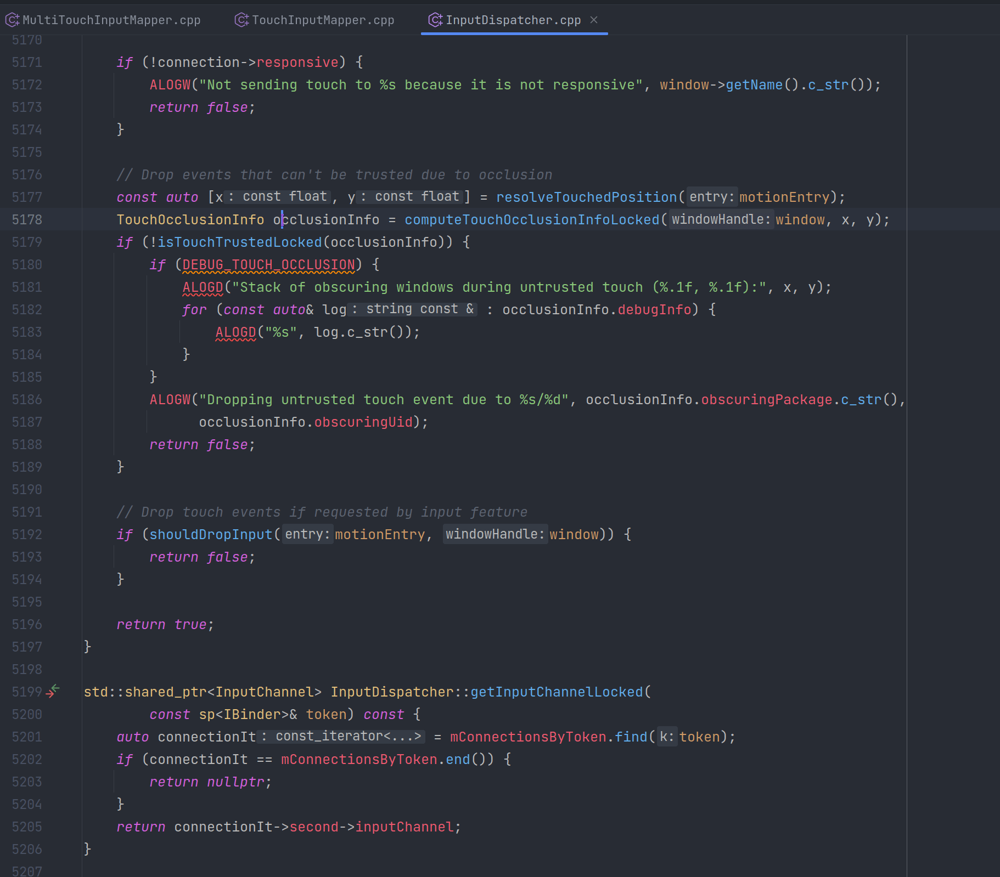
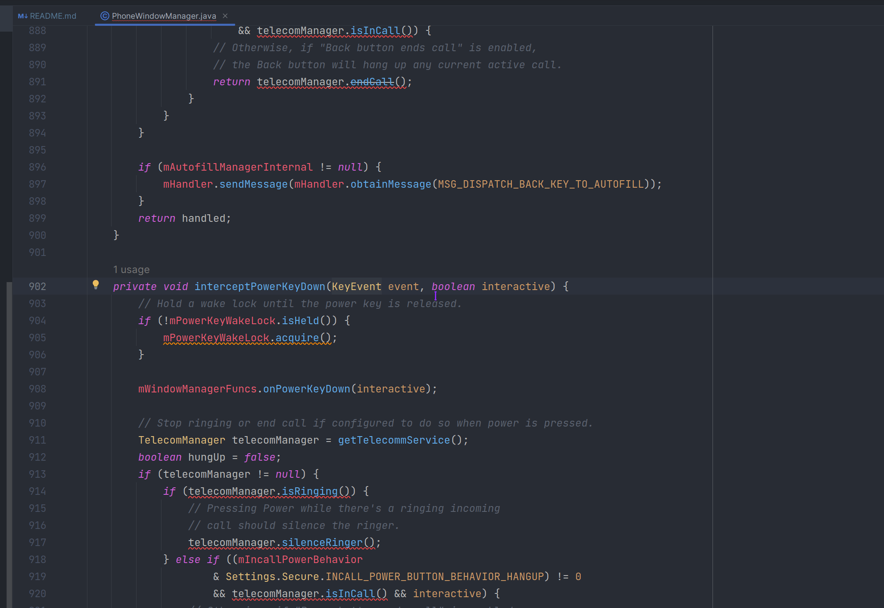

# as aosp

## 简介

此as工程可以快速的导入aosp framework(包含java/native部分)、 aosp 系统app、 国内某些厂商扩展的fwk代码，比这个 https://www.jianshu.com/p/2ba5d6bd461e 方案还快，并且“联想”也很方便。

### 对比 asfp 优缺点

<table>

<thead>
<tr>
<th align="center"></th>
<th align="center">as-asop</th>
<th align="center">asfp</th>
</tr>
</thead>

<tbody><tr>

<td align="center">author</td>
<td align="center">Solo</td>
<td align="center">Google</td>
</tr>

<tr>
<td align="center">发布时间</td>
<td align="center">2022下半年</td>
<td align="center">2023下半年</td>
</tr>

<tr>
<td align="center">支持平台</td>
<td align="center">linux、macos、win</td>
<td align="center">linux</td>
</tr>

<tr>
<td align="center">Android Studio 版本</td>
<td align="center">任意版本</td>
<td align="center">特殊版本，即asfp版本</td>
</tr>

<tr>
<td align="center">以下代码支持跳转、提示</td>
<td align="center">java、kotlin、c、c++</td>
<td align="center">java、kotlin、c、c++</td>
</tr>

<tr>
<td align="center">是否需要编译</td>
<td align="center">否</td>
<td align="center">需要全编</td>
</tr>

<tr>
<td align="center">是否需要下载完整代码</td>
<td align="center">否</td>
<td align="center">需要下载完整的aosp代码</td>
</tr>

<tr>
<td align="center">首次加载耗时</td>
<td align="center">根目录只有部分模块代码，加载几分钟；<br>根目录包含所有aosp代码，加载1.5h左右</td>
<td align="center">代码已全编译，加载1h左右；<br>代码未全编译，编译时间+加载1h左右</td>
</tr>

<tr>
<td align="center">UI</td>
<td align="center">无UI，通过改脚本来实现功能，自定义度高</td>
<td align="center">有UI，可通过界面添加模块（依赖每个模块的android.bp，无法自定义）</td>
</tr>

</tbody>

</table>


> 关于 “首次加载耗时” 提到 “根目录只有部分模块代码” ，我试过两种方案：
> 1. 软链接：比如完整的aosp代码是在/home/solo/workspace/code/aosp，我把需要加载的模块通过软链接的方式 ln 到 /home/solo/code/aosp。
>    可以参考工程里的 ln.sh 脚本文件（感谢 https://github.com/aqxuwenda 提供的脚本），SOURCE、DEST改成自己的源目录，目标目录即可；也可以在数组projects中添加自己需要的模块目录。
>    ln.sh 脚本文件里只软链接了常用的一些模块，每个人可以根据自己的需求删改。
> 2. 只下载需要模块。
>
> “支持平台” 提到as-asop支持win，经过朋友的测试，是没任何问题的，但有一点需要注意：
> 如果你的代码目录是 D:\code\aosp\
> 请不要写成 D:\\code\\aosp\\
> 正确的写法 D:/code/aosp/
>
> 总结：遥遥领先[狗头]


下面以cpp代码为例，演示代码的跳转以及提示、补全。

### 跳转


### 提示、补全



### 约定

- aosp模块：大驼峰命名
- aosp模块变种或厂商模块：小写命名（包含字符-）


## 警告

关于此工程中包含miui、flyme、oppo、vivo等配置，只是一个空的gradle配置；该工程中不涉及到任何这几家公司的代码。

请勿小事化大！切勿胡说八道！


## 配置介绍

### settings.gradle

settings.gradle位于根目录下，用于项目的配置，常见的是配置子工程。一个子工程只有在setting.gradle中配置了，才能够被识别，构建的时候才会被包含进去。
如果需要新增一个aosp的模块，需要在这里配置。

使用者可以根据自己的需求修改settings.gradle的子模块，比如Settings开发不需要native部分、SystemUI部分等，可以注释使其不被识别，加快加载as速度，降低内存。


### 根目录build.gradle

根目录build.gradle文件配置了很多扩展的gradle脚本，可根据实际情况自行添加到对应的脚本或者新增脚本。
```bash
apply from: 'scripts/config.gradle'
apply from: 'scripts/aosp.gradle'
apply from: 'scripts/car.gradle'
apply from: 'scripts/vivo.gradle'
```


#### config.gradle

config.gradle最重要的功能就是通过aospRoot配置Android源码的根目录。

> aosp.gradle
> car.gradle
> ext.gradle
> miui.gradle
> flyme.gradle
> oppo.gradle
> vivo.gradle
> 意思gradle脚本都是通过config.gradle的aospRoot获取到Android源码的根目录。

config.gradle脚本除了配置基本的android sdk；还有一个很重要的功能，就是获取所有的模块名称（也就是settings.gradle配置的子模块）。

也就是说 allModules不需要手动维护，在settings.gradle里新增一个module，脚本会自动识别到project name并添加到allModules数组。
这个allModules数组的作用是方便每个module快速的互相依赖，如：
```bash
rootProject.ext.allModules.each { dependence -> compileOnly project(dependence.value) }
```
以上写法会循环依赖，真正的app gradle工程不能这样做的。这里这样子做是因为我们只是为了方便as阅读代码或者改代码，真正编译的时候还是用ninja、make。

#### aosp.gradle

- aospDir: 通过config.gradle的aospRoot获取到Android源码的根目录。也可以自己配置源码所在的目录，如: aospDir = "/home/solo/code/aosp"。
- aosp: 一个大数组，维护很多模块需要的路径。
  - root: 等同于aospDir所设置的android源码根目录。
  - Framework: 配置framework.jar的源码路径
  - Services: 配置services.jar的源码路径
  - FrameworkRes: 配置frameworkRes.apk的源码路径
  - SystemUI: 配置SystemUI.apk的源码路径
  - SystemUIPluginLib: 配置SystemUIPluginLib.jar的源码路径
  - Settings: 配置Settings.apk的源码路径
  - SettingsLib: 配置SettingsLib.aar的源码路径
  - SettingsProvider: 配置SettingsProvider.apk的源码路径
  - CarFramework: 配置CarFramework的源码路径
  - CarServices: 配置CarServices.apk的源码路径
  - Connectivity: 连接相关，包括Tethering、nearby、netd等等的源码路径
  - Wifi: 配置wifi相关的源码路径
  - ExtServices: ExtServices.apk的源码路径


> 以上的 Framework、Services、FrameworkRes、SystemUI、SystemUIPluginLib、Settings、SettingsLib、SettingsProvider、CarFramework、CarServices
> 通过manifest、res、assets、jni、src来分别配置AndroidManifest.xml、资源文件目录、assets目录、jni代码目录、java\kt源码目录等。
>
> 不需要的可以写空或者随便写一个不存在的文件、目录。

> 温馨提示
>
> 在这个文件中只需要把 aospDir 设置成自己android源码的根目录就可以。
>
> 里面具体模块的源码路径基本上都添加了（但确实不是100%添加），如果因为使用aosp版本不一致或者别的原因可以根据自己需要再添加。


#### vivo.gradle

vivo代码所在的路径，主要是配置了 vivo-framework、vivo-services、vivo-framework-res。

可以根据自己的需要修改vivoDir对应的目录即可。


### native

通过根目录下的settings.gradle可以看到有如下的配置：

```bash
/*************** aosp native ***************/
include ':aosp-native'
//include ':AndroidRuntime'
//include ':AndroidServices'
//include ':InputFlinger'
//include ':SurfaceFlinger'
//include ':NeuralNetworks'
//include ':TensorFlow'
/*************** aosp native ***************/
```

- AndroidRuntime: 对应的是frameworks/base/core/jni/Android.bp写的libandroid_runtime。也就是frameworks base core jni。
- AndroidServices: 对应的是 frameworks/base/libs/services、frameworks/base/services/core/jni、frameworks/base/services/incremental。也就是libservic、libservices.core、libservices.core-gnss、service.incremental的和。
- InputFlinger: 对应的是frameworks/native/services/inputflinger。
- SurfaceFlinger: 对应的是frameworks/native/services/surfaceflinger。
- aosp-native: 是把以上四个模块的整合到一起了，这么做是因为都放在一个模块里跳转方便，占用的内存也最少。

- NeuralNetworks: 封装tensorflow源码
- TensorFlow: google的tensorflow源码

在每个cmake文件里都设置了这么一些变量，主要是用来控制是否加载相应的代码目录。

这里基本上只是把常用到的都打开了，如果需要把全部打开，改成true即可。
（如果都打开as占用内存会很大）
```bash
set(AOSP_SYSTEM_COMMON true)
set(AOSP_OUT false)
set(AOSP_AV false)
set(AOSP_ART false)
set(AOSP_BIONIC false)
set(AOSP_SYSTEM false)
set(AOSP_EXTERNAL false)
set(AOSP_PACKAGES false)
set(AOSP_HARDWARE false)
```

### 删除android.jar

根据以上步骤配置好后看，c/cpp代码可以正确跳转了；但java有的代码还是跳转到Android SDK的android.jar里。所以还需要多做一步额外的配置，如下图：


如果在 .idea/modules 文件夹下没看到“以模块为名词”文件夹，那需要如上图勾选"generate *.impl files for modules import from gradle"。

看到.idea/modules文件夹下生成“以模块为名词”文件夹，接着sync，sync过程中gralde会执行deleteAndroidSdk 任务。这个task主要的作用就是去删除iml文件中的：

```bash
<arg>$USER_HOME$/Android/Sdk/platforms/android-34/android.jar</arg>
<arg>$USER_HOME$/Android/Sdk/build-tools/34.0.0/core-lambda-stubs.jar</arg>
```

并把下面这行配置放在最后面。

```bash
<orderEntry type="jdk" jdkName="Android API 34, extension level 7 Platform" jdkType="Android SDK" />
```

sync后确认iml文件中以上提的都已经执行好了，就可以重启AS；重启之后打开一个任意一个java代码都会看到：


点KeyEvent已经能正确跳转到源码了，而不是跳转到Android SDK的android.jar里。

> 关于勾选"generate *.impl files for modules import from gradle"后，要不要去掉勾选的问题，可以视情况而定。
>
> 其目的只是为了 .idea/modules 文件夹下每个模块都有自己的iml配置。并确保iml中没有android.jar的配置和jdk的排序在最后面即可。
>
> 如果配置目录新增了src或者配置了新的路径对的，建议更新iml并重新sync(确保删除Android SDK的配置)。


### 支持AIDL

在 scripts/config.gradle 里配置 build_aidl = true ，并 "Rebuild Project" 就可以生成java文件。

生成 java 文件后改成 false ，确保模块直接能正常跳转。

因为前面提到过模块互相循环依赖，无法无法编译； 所以在 scripts/android-build.gradle 里配置了如下：

```
if (rootProject.ext.build_aidl.toBoolean()) {
    println("don't implementation forEach when build aidl")
} else {
    println(dependence.value)
    implementation project(dependence.value)
}
```


## 首次加载

如果设置的root目录包含整个aosp工程，首次打开会很慢。可以把.idea/misc.xml改成如下：
打开AS会比较快，后续在sync project的时候会在gralde的excludeFolder认为在真正的module里把忽略的文件夹放到对应的iml配置里。
若当前配置的忽略文件夹跟你需要有出入，可以在 scripts/exclude-folder.py 里自行修改。

```bash
<project version="4">
  <component name="ProjectRootManager" version="2" languageLevel="JDK_17" default="true" project-jdk-name="jbr-17" project-jdk-type="JavaSDK">
    <output url="file://$PROJECT_DIR$/build/classes" />
    <content url="file://$MODULE_DIR$">
      <excludeFolder url="file://$MODULE_DIR$/art" />
      <excludeFolder url="file://$MODULE_DIR$/bionic" />
      <excludeFolder url="file://$MODULE_DIR$/bootable" />
      <excludeFolder url="file://$MODULE_DIR$/build" />
      <excludeFolder url="file://$MODULE_DIR$/cts" />
      <excludeFolder url="file://$MODULE_DIR$/dalvik" />
      <excludeFolder url="file://$MODULE_DIR$/developers" />
      <excludeFolder url="file://$MODULE_DIR$/development" />
      <excludeFolder url="file://$MODULE_DIR$/device" />
      <excludeFolder url="file://$MODULE_DIR$/disregard" />
      <excludeFolder url="file://$MODULE_DIR$/external" />
      <excludeFolder url="file://$MODULE_DIR$/hardware" />
      <excludeFolder url="file://$MODULE_DIR$/kernel" />
      <excludeFolder url="file://$MODULE_DIR$/libcore" />
      <excludeFolder url="file://$MODULE_DIR$/libnativehelper" />
      <excludeFolder url="file://$MODULE_DIR$/out" />
      <excludeFolder url="file://$MODULE_DIR$/packages" />
      <excludeFolder url="file://$MODULE_DIR$/pdk" />
      <excludeFolder url="file://$MODULE_DIR$/platform" />
      <excludeFolder url="file://$MODULE_DIR$/platform_testing" />
      <excludeFolder url="file://$MODULE_DIR$/prebuilts" />
      <excludeFolder url="file://$MODULE_DIR$/.repo" />
      <excludeFolder url="file://$MODULE_DIR$/sdk" />
      <excludeFolder url="file://$MODULE_DIR$/system" />
      <excludeFolder url="file://$MODULE_DIR$/test" />
      <excludeFolder url="file://$MODULE_DIR$/toolchain" />
      <excludeFolder url="file://$MODULE_DIR$/tools" />
      <excludeFolder url="file://$MODULE_DIR$/vendor" />
    </content>
  </component>
  <component name="ProjectType">
    <option name="id" value="Android" />
  </component>
</project>
```

## 编译

此工程无法编译framework.jar或者services.jar，请使用aosp推荐的编译方式。

[global_scripts](https://github.com/i-rtfsc/global_scripts) 工程里的 [gs_android_build.sh](https://github.com/i-rtfsc/global_scripts/blob/main/plugins/android/build/gs_android_build.sh) 脚本实现了很多模块编译的快捷键。
可以单独下载这个脚本并放到环境变量里，或者是用整个 [global_scripts](https://github.com/i-rtfsc/global_scripts) 实现插件化的方案【详情可以参考该工程的README】。


## 后话

再次说明此工程包含的 miui、flyme、oppo、vivo 等配置 不涉及任何这几家公司的代码，所以并没有泄露任何公司的代码！

分享此工程的目的是为了android系统工程师能提高工作效率！请勿小事化大！

此工程拆封成很多分支，默认是 aosp 分支。切分支有惊喜[狗头]。